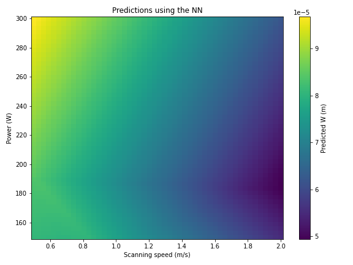

## Description

**LPBF-SimDriver** is a collection of Python scripts that automate **single-track laser powder bed fusion (LPBF) simulations** using solvers from the **LaserbeamFoam** family in OpenFOAM.  
It is designed to make it easy to study how process parameters—such as laser power, scanning speed, and laser spot size—affect the morphology of melt tracks in a systematic and reproducible way.  

Given a table of parameter sets, LPBF-SimDriver will:

1. **Generate and run cases**  
   Create one simulation case per parameter combination, patch the relevant OpenFOAM dictionaries, and run the simulations either locally or on the HPC system of your choice (via SSH/Slurm).

2. **Post-process results**  
   Use ParaView (`pvpython`) scripts to extract geometric quantities of the melt tracks, including width, depth, height-to-flat ratio, and continuity.

3. **(Optional) Train a surrogate model**  
   Train a simple neural network to predict geometry-related quantities for new combinations of input parameters, enabling rapid design-space exploration.

---

### Current scope and future directions

- **Solver support**: LPBF-SimDriver currently runs with **laserMeltFoam**. In future versions, **laserBeamFoam** will also be selectable, allowing users to choose the solver best suited to their study.  
- **Simulation type**: the present version is tailored for **single-track simulations**. The structure of the workflow is designed to be extensible, with planned support for more complex setups (e.g. multi-track or layer-by-layer builds).

## Prerequisites

Before using **LPBF-SimDriver**, make sure the following software and environments are available:

- **LaserMeltFoam (OpenFOAM v2412)**  
  The current version of LPBF-SimDriver supports **only** the `laserMeltFoam` solver, which has been ported to **OpenFOAM v2412**.  
  Other solvers (e.g. `laserBeamFoam`) and OpenFOAM versions will be supported in future releases.

- **ParaView**  
  ParaView with `pvpython` must be installed and available on your `PATH`. ParaView ≥ 5.7 is recommended.

- **Python 3.8.12**  
  With the following key packages:  
  - `numpy`, `pandas`, `joblib`  
  - `matplotlib` (for plotting)  
  - `scikit-learn`, `tensorflow/keras` (for surrogate model training)  

  The exact Python environment used in development can be recreated from the file included in this repository:
  ```bash
  # with conda
  conda env create -f environment.yml
  conda activate lpbfsimdriver

  # or with pip
  pip install -r requirements.txt


If you want to run your simulations on an HPC system, you will need:

- Access to a cluster running **Slurm**  
- Passwordless **SSH** set up between your local machine and the cluster

## Instructions

Once the prerequisites are installed and configured, you can run **LPBF-SimDriver** in three main stages.

### 1. Run the simulations

#### 1.1 Prepare the parameter table

Before running simulations, you need to define the set of input parameters in a file called `parameters.txt`.  
Each row corresponds to one simulation case, and the current workflow expects at least three columns:

- **Scanning speed** (m/s)  
- **Laser power** (W)  
- **Laser spot size** (m)  

An example `parameters.txt` looks like this:

```text
Scanning Speed (m/s) | Power (W)  | Spot size (m)    # Taken from Parivendhan PhD thesis
1                         150             80e-6
1.5                       150             80e-6
2                         150             80e-6
1                         200             80e-6
1.5                       200             80e-6
2                         200             80e-6
1                         250             80e-6
1.5                       250             80e-6
2                         250             80e-6
0.5                       150             80e-6
0.5                       200             80e-6
0.5                       250             80e-6
1                         300             80e-6
1.5                       300             80e-6
2                         300             80e-6
```

#### 1.2 Configure the driver

Next, open the file `input_data.py` and adjust its fields to match your setup.  
This file contains the **global settings** that LPBF-SimDriver uses when generating and running cases.

The most important fields are:

- `RUNNING_ON`  
  Set this to `"LOCAL"` if you want to run the cases on your own machine,  
  or to the name of your HPC system (e.g., `"Meluxina"`) if you plan to run remotely.

- `MESH_DENSITY`  
  Choose the mesh resolution you want to use for your simulations (e.g., `"coarse"` or `"fine"`).  
  The code will look for the corresponding base case in this folder.

- `OPENFOAM_VERSION`  
  Currently, only `2412` is supported (because this is the version where `laserMeltFoam` has been ported).  
  Other versions will be supported in future releases.

- `SEED`, `n_epochs`, and other optional parameters  
  Used for surrogate model training; can be left as default if you are not training a neural network.

---

In the **example code included in this repository**, we set up `RUNNING_ON` to use an HPC system available at **University College Dublin**, called **Xenosim**.  
This demonstrates how the driver can be adapted to specific clusters through host-specific configuration files.

The convention used in LPBF-SimDriver is that files in the `input_files/` folder must follow the structure: <name_of_hpc_system>_inp.py

For example:

- To use the **Xenosim** system, the file must be named `xenosim_inp.py`.  
  A minimal version of that file looks like this:

  ```python
  hostname    = "xenosim"
  run_address = "/home/simon/run/"
  OF_LOCATION = "$HOME/OpenFOAM/OpenFOAM-v2412/etc/bashrc"

#### 1.3 Create the base OpenFOAM case (template)

LPBF-SimDriver needs a **template case** that it will copy and modify to produce each simulation.  
By convention, the template must live at <MESH_DENSITY>/base_case_of2412/ where `MESH_DENSITY` is the value you set in `input_data.py` (e.g., `COARSE`, `FINE`).

**Examples**
- If `MESH_DENSITY = "COARSE"` → `COARSE/base_case_of2412/`
- If `MESH_DENSITY = "FINE"`   → `FINE/base_case_of2412/`

A minimal directory layout might look like:

**Why “of2412”?**  
The current driver supports **laserMeltFoam ported to OpenFOAM v2412**, so the template name reflects the version.  
Future versions may add templates for other OpenFOAM releases.

**What the driver will do with this template**
- For each row in `parameters.txt`, LPBF-SimDriver copies `.../base_case_of2412/` to a new `test_case_<i>/`.
- It then **patches the dictionaries** (e.g., scan speed, laser power, spot size) according to that row.
- Finally, it **runs** each case (locally or on HPC, depending on your configuration).

> 💡 Tip: keep the template as clean as possible—no post-processed results inside, and only the files your solver needs. This ensures fast copies and avoids polluting generated cases.

**Special note for HPC users**  
If you are running on an HPC system, the base case **must also include a Slurm submission script**.  
By convention, this file must be named singleTrack<name_of_hpc>.sh 
This convention allows the driver to locate the correct script automatically, depending on the HPC system you selected in `input_data.py`.

**Why is this needed?**   
Different HPC systems may require loading different modules or libraries (e.g., specific versions of MPI).  
The submission script is where you specify those commands.

**Example**  
In this repository, we provide singleTrackXenosim.sh which is used when submitting jobs to the **Xenosim** cluster at University College Dublin.

#### 1.4 Run the simulations

Once the parameter table (`parameters.txt`), the driver configuration (`input_data.py`), and the base case template are in place, you can generate and run all simulations with:

```bash
python generate_data.py    
```

After this step, you will have one simulation folder per parameter combination inside your chosen `MESH_DENSITY` folder.  

For example, if you defined 5 rows in `parameters.txt` and set `MESH_DENSITY = "COARSE"`, you will end up with:

```text
COARSE/
├─ base_case_of2412/
├─ test_case_1/
├─ test_case_2/
├─ test_case_3/
├─ test_case_4/
└─ test_case_5/
```

---


### 2. Measure the geometry of the resulting tracks

Once the simulations have finished, the next step is to extract the **geometrical characteristics** of the melt tracks from the OpenFOAM results.  
LPBF-SimDriver provides the script `measure_W_H_D.py` for this purpose.

Run it with:

```bash
python measure_W_H_D.py
```

The workflow in this stage performs the following steps:

a. **Continuity check**  
   A slice is taken along the middle section of the track.  
   If material is present along the full trajectory in this plane, the track is considered continuous.

b. **Geometric quantities at the mid-plane**  
   If the track passes the continuity check, a transverse plane is taken at the middle of the track.  
   The main geometrical quantities are then calculated:  
   - **W** (width)  
   - **H** (height)  
   - **D** (depth)  

These quantities are illustrated conceptually in the figure below:


- **W** – track width  
- **H** – track height  
- **D** – track depth

These values are saved as separate files:  
- `W.joblib`  
- `H.joblib`  
- `D.joblib`

c. **Cross-section analysis along the track**  
   The same calculation is repeated at multiple cross-sections along the track.  
   - Results for each section are stored in `section_metrics_along_y.csv` (and a corresponding joblib file).  
   - A summary file `section_metrics_summary_y.csv` (with joblib) contains the **mean** and **standard deviation** of the measured quantities across all sections.
---


### 3. (Optional) Train a surrogate model  

Once the simulation results and geometric measurements are available, you can use them to train a **neural network surrogate model**.  
This step is optional, but it enables rapid exploration of the design space without running additional simulations.  

Run the script with:  

```bash
python create_and_train_surrogate_model.py
```

The workflow in this stage performs the following steps:

1. **Collect training data**  
   Gather the input parameters from `parameters.txt` and the measured outputs (`W`, `H`, `D`, and continuity`) stored in the processed results.

2. **Preprocess the inputs**  
   Normalise the data and split it into training/validation sets.

3. **Train the model**  
   By default, a simple **feedforward neural network** with **10 hidden nodes** is trained to map process parameters → geometric quantities.  
   Conceptually, the current implementation is depicted below:

   

   - **Inputs**: laser power, scanning speed, laser spot size  
   - **Hidden layer**: 10 nodes (dense, fully connected)  
   - **Outputs**: predicted track width (**W**), height (**H**), and depth (**D**)  

   The number of nodes, layers, and other hyperparameters can be **easily modified** in the script to explore different network architectures.

4. **Save the trained model**  
   After training, the network is saved as:  
   - `surrogate_model.h5` (Keras model)  
   - `training_history.png` (loss curves)

5. **Use the surrogate**  
   Once trained, the surrogate can predict melt track geometry for **new combinations of parameters** without running full CFD simulations.

For example, the figure below shows the **predicted track width (W)** as a function of laser power and scanning speed, obtained from the trained neural network surrogate:



Similar figures are generated for the predicted **track depth (D)** and **track height (H)**, allowing for a complete visualisation of how process parameters influence melt track geometry.  

Such visualisations make it possible to:  
- Explore the design space efficiently  
- Identify stable processing windows  
- Detect parameter ranges that may cause lack of fusion or excessive penetration  


🔧 **Customisation and extensions**  
- The default neural network can be adjusted (e.g. more layers, different activation functions, alternative optimisers).  
- Other surrogate modelling approaches—such as Gaussian processes, random forests, or gradient-boosted trees—can also be integrated with minimal changes, since the data-preparation workflow is independent of the model type.  

💡 *Tip: This step is especially useful if you plan to explore a **large parameter space** or perform **optimisation studies**.*

### Who do I talk to? ###

- **Simon Rodriguez** – [simon.rodriguezluzardo@ucdconnect.ie](mailto:simon.rodriguezluzardo@ucdconnect.ie) | [LinkedIn](https://www.linkedin.com/in/simonrodriguezl/)  
- **Petar Cosic** – [petar.cosic@ucdconnect.ie](mailto:petar.cosic@ucdconnect.ie)  
- **Thomas Flint** – [tom.flint@manchester.ac.uk](mailto:tom.flint@manchester.ac.uk) | [LinkedIn](https://www.linkedin.com/in/tom-flint-87ba9748/)  
- **Philip Cardiff** – [philip.cardiff@ucd.ie](mailto:philip.cardiff@ucd.ie) | [LinkedIn](https://www.linkedin.com/in/philipcardiff/)  

### References

Flint, T. F., Robson, J. D., Parivendhan, G., & Cardiff, P. (2023). laserbeamFoam: Laser ray-tracing and thermally induced state transition simulation toolkit. SoftwareX, 21, 101299.

Flint, T. F., Parivendhan, G., Ivankovic, A., Smith, M. C., & Cardiff, P. (2022). beamWeldFoam: Numerical simulation of high energy density fusion and vapourisation-inducing processes. SoftwareX, 18, 101065.

Flint, T. F., et al. A fundamental analysis of factors affecting chemical homogeneity in the laser powder bed fusion process. International Journal of Heat and Mass Transfer 194 (2022): 122985.

Flint, T. F., T. Dutilleul, and W. Kyffin. A fundamental investigation into the role of beam focal point, and beam divergence, on thermo-capillary stability and evolution in electron beam welding applications. International Journal of Heat and Mass Transfer 212 (2023): 124262.

Parivendhan, G., Cardiff, P., Flint, T., Tuković, Ž., Obeidi, M., Brabazon, D., Ivanković, A. (2023) A numerical study of processing parameters and their effect on the melt-track profile in Laser Powder Bed Fusion processes, Additive Manufacturing, 67, 10.1016/j.addma.2023.103482.
