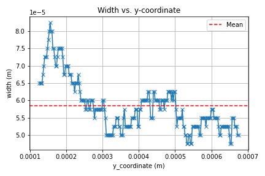
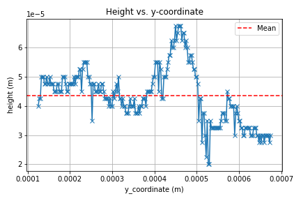
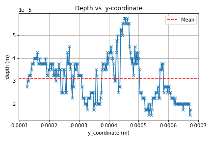
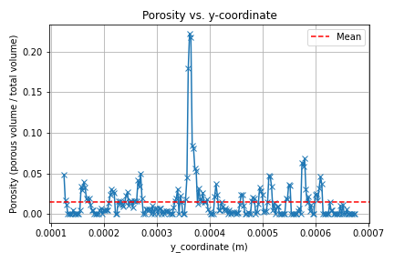
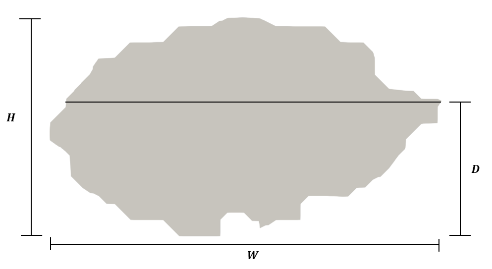

# SimToPC

## Description

**SimToPC** is an open-source Python package that provides an **end-to-end simulation-to-characterisation workflow** for **single-track Laser Powder Bed Fusion (LPBF)** studies.

It supports **case generation and execution**, automated **post-processing**, and the extraction of **track-resolved melt-pool geometry and porosity metrics** from high-fidelity simulations. By analysing the melt pool along the **entire scan track**, SimToPC enables full-field characterisation beyond conventional centreline or single-slice measurements.

SimToPC includes an automated **track continuity check** that identifies whether a continuous melt track is formed. Geometric metrics are evaluated only for continuous tracks, while discontinuous cases are flagged and excluded from further analysis.

The tool is designed to work with **OpenFOAM-based LPBF solvers** and is demonstrated using **laserMeltFoam**. It produces **structured, machine-learning-ready datasets** and can optionally be used to train surrogate models for rapid exploration of process-parameter spaces.


### Outputs

SimToPC produces **track-resolved melt-pool metrics along the full scan path**.
Typical outputs are illustrated below.

| Width (W) | Height (H) |
|-----------|------------|
|  |  |

| Depth (D) | Porosity |
|-----------|----------|
|  |  |

The extracted metrics are defined on a **per-cross-section basis** along continuous tracks, as illustrated below.



- **W (width)**: maximum lateral extent of the melt pool in the cross-section.
- **H (height)**: vertical extent of the melt pool, accounting for surface and internal pores.
- **D (depth)**: vertical distance from the lowest material point to the location of maximum width.
- **Porosity**: ratio of pore cells to total cells in the cross-section (equivalent to a volume fraction for uniform meshes).

In addition, SimToPC outputs:

- **Track continuity flags** (continuous / discontinuous),
- **Aggregated datasets** (CSV) suitable for statistical analysis and machine learning.


### How to use

#### Command-line workflow

SimToPC is operated through a command-line interface of the form:

```bash
simtopc <command> config.yml
```

where <command> selects the stage of the workflow and config.yml defines the user-provided input parameters.

The available commands are:

- **generate**: prepares and executes LPBF simulation cases from the specified operational parameters.

- **measure**: post-processes completed simulations, assesses track continuity, and extracts melt-pool geometry and porosity metrics.

- **surrogate** (optional): trains a surrogate model from the extracted datasets for rapid exploration of the process-parameter space.

Only the **measure** stage is required to obtain the primary outputs of SimToPC.


#### Prerequisites

For full functionality, the following software is required:

- **OpenFOAM v2412** with `laserMeltFoam`
- **ParaView** with `pvpython` (≥ 5.7 recommended)
- **Python** ≥ 3.8

#### Installation

First, clone this GitHub repository. 

```bash
git clone git@github.com:laserbeamfoam/SimToPC.git
```

Then, it is recommended to install SimToPC in a clean Python virtual environment.

```bash
cd SimToPC
python -m venv .venv
source .venv/bin/activate
pip install .
```

You can verify that the command-line interface is available:

```bash
simtopc --help
```

If the installation was correct, you should see a message like this:

```bash
usage: simtopc [-h] {measure,surrogate,generate} ...

positional arguments:
  {measure,surrogate,generate}
    measure             Measure melt-pool metrics
    surrogate           Train surrogate model (requires TensorFlow)
    generate            Generate and run simulations (requires OpenFOAM
                        environment)

optional arguments:
  -h, --help            show this help message and exit
```


#### Tutorial overview

SimToPC provides three command-line modes that together define the full workflow:

- **generate**: prepares and executes LPBF simulation cases.
- **measure**: post-processes completed simulations and extracts melt-pool metrics.
- **surrogate** (optional): trains surrogate models from the extracted datasets.

Detailed, mode-specific tutorials are provided in the `examples` directory:
- `examples/generate/README.md`
- `examples/measure/README.md`
- `examples/surrogate/README.md`


### Who do I talk to? ###

SimToPc is a collaboration between **Philip Cardiff’s lab** (University College Dublin) and **Thomas Flint’s lab** (University of Manchester).  

For questions, suggestions, or contributions, please feel free to reach out:

- **Simon Rodriguez** – [simon.rodriguezluzardo@ucdconnect.ie](mailto:simon.rodriguezluzardo@ucdconnect.ie) | [LinkedIn](https://www.linkedin.com/in/simonrodriguezl/)  
- **Petar Cosic** – [petar.cosic@ucdconnect.ie](mailto:petar.cosic@ucdconnect.ie)  
- **Thomas Flint** – [tom.flint@manchester.ac.uk](mailto:tom.flint@manchester.ac.uk) | [LinkedIn](https://www.linkedin.com/in/tom-flint-87ba9748/)  
- **Philip Cardiff** – [philip.cardiff@ucd.ie](mailto:philip.cardiff@ucd.ie) | [LinkedIn](https://www.linkedin.com/in/philipcardiff/)  


We welcome feedback and collaborations. If you use SimToPc in your research, please let us know — and consider citing the relevant papers listed below.


### References

Flint, T. F., Robson, J. D., Parivendhan, G., & Cardiff, P. (2023). laserbeamFoam: Laser ray-tracing and thermally induced state transition simulation toolkit. SoftwareX, 21, 101299.

Flint, T. F., Parivendhan, G., Ivankovic, A., Smith, M. C., & Cardiff, P. (2022). beamWeldFoam: Numerical simulation of high energy density fusion and vapourisation-inducing processes. SoftwareX, 18, 101065.

Flint, T. F., et al. A fundamental analysis of factors affecting chemical homogeneity in the laser powder bed fusion process. International Journal of Heat and Mass Transfer 194 (2022): 122985.

Flint, T. F., T. Dutilleul, and W. Kyffin. A fundamental investigation into the role of beam focal point, and beam divergence, on thermo-capillary stability and evolution in electron beam welding applications. International Journal of Heat and Mass Transfer 212 (2023): 124262.

Parivendhan, G., Cardiff, P., Flint, T., Tuković, Ž., Obeidi, M., Brabazon, D., Ivanković, A. (2023) A numerical study of processing parameters and their effect on the melt-track profile in Laser Powder Bed Fusion processes, Additive Manufacturing, 67, 10.1016/j.addma.2023.103482.

