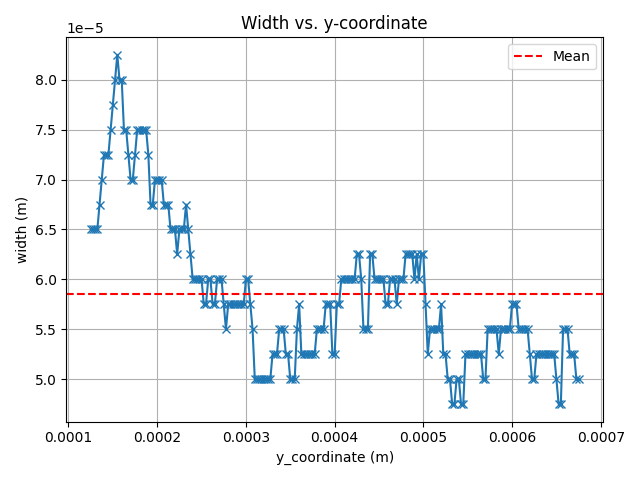

# Measure

## Purpose

This example shows how to run the `measure` mode of SimToPC on a set of
previously completed LPBF simulation cases.

The goal of this example is not to rerun the expensive simulations, but to
demonstrate how SimToPC post-processes completed cases to:

- check melt-track continuity,
- extract track-resolved melt-pool geometry,
- and compute operational void-fraction metrics along the scan path.

General installation and project-wide prerequisites are described in the main
repository [README](../../README.md).

---

## What This Example Uses

This example assumes that the simulation cases have already been executed.

To avoid rerunning costly OpenFOAM simulations, the example relies on a reduced
dataset distributed in a separate repository. The reduced dataset contains the
case directories needed by `measure`, but not the full original simulation
outputs.

In particular:

- unnecessary OpenFOAM fields such as `p` have been removed,
- `polyMesh` has been removed from each case directory,
- the mesh therefore needs to be reconstructed before post-processing.

This means that the reproducible path for this example is:

1. obtain the reduced dataset,
2. reconstruct the mesh in each case,
3. run `simtopc measure config.yml`.

---

## Example-Specific Requirements

In addition to the general SimToPC setup described in the main README, this
example requires:

- access to the reduced dataset repository,
- OpenFOAM with `blockMesh`,
- ParaView with `pvpython`.

---

## Get the Reduced Dataset

Clone the external dataset repository:

```bash
git clone git@github.com:ScimonCFD/SimToPC_measure_data.git
```

Then extract the reduced dataset:

```bash
mv SimToPC_measure_data/COARSE.zip .
rm -rf SimToPC_measure_data
unzip COARSE.zip
rm COARSE.zip
```

After extraction, the following structure should exist:

```text
COARSE/test_case_i/
```

where `i` is the index of the parameter combination.

---

## Reconstruct the Mesh

Because `polyMesh` is not included in the reduced dataset, the mesh must be
rebuilt before running `measure`.

For an individual case:

```bash
cd COARSE/test_case_i
blockMesh > log.blockMesh
```

To rebuild the mesh for all cases:

```bash
for d in COARSE/test_case_*; do
    echo "Running blockMesh in $d"
    cd "$d" || exit
    blockMesh > log.blockMesh
    cd - > /dev/null
done
```

This assumes that each case contains a valid `blockMeshDict`.

---

## Run the Example

From the `examples/measure` directory, run:

```bash
cd examples/measure
simtopc measure config.yml
```

This command uses the local `config.yml`, the local `parameters.txt`, and the
extracted `COARSE/test_case_i`
directories located beside them.

---

## Example Configuration Notes

The example configuration focuses on the parameters needed by `measure`:

- `y_begin`, `y_end`: nominal measurement window along the scan direction,
- `x_min`, `x_max`: lateral range used to define the analysed melt-pool region,
- `cell_size`: mesh spacing used by the post-processing logic,
- `min_points_per_zrow`: minimum support used in continuity and section checks,
- `trim`: optional exclusion of material near the beginning and end of the
  track.

When trimming is enabled:

- `start_spot_sizes` and `end_spot_sizes` are given in multiples of
  `spot size`,
- `spot size` means the **laser diameter**,
- trimming boundaries are projected onto valid mesh-aligned sections.

---

## Measurement Procedure

For each simulation case, SimToPC analyses the track cross-section by
cross-section along the scan direction.

It first performs a continuity check. If the track is classified as
discontinuous, geometric characterisation is skipped for that case.

For continuous tracks, SimToPC computes:

- **W (width)**: maximum lateral extent of the melt pool,
- **H (height)**: vertical extent of the melt pool, accounting for the
  operational treatment of surface-connected and internal voids,
- **D (depth)**: vertical distance from the lowest material point to the
  location of maximum width,
- **Operational void fraction**: ratio of detected void cells to total
  reconstructed cells in the cross-section.

The current CSV files retain historical column names such as `porosity_at_iy`,
`row_has_pores`, and `number_of_pores_in_row`. These columns should be read as
void-fraction or void-cell descriptors. Only fully enclosed voids should be
interpreted as internal pores in the strict metallurgical sense.

These quantities are evaluated along the full scan track.

---

## Expected Outputs

For each `test_case_i`, `measure` now groups its outputs into dedicated
subdirectories inside the case directory.

The main outputs are:

- `measure_results/row_statistics.csv`: row-level geometry and void-count
  information,
- `measure_results/cross_sections_statistics.csv`: cross-section-level W, H,
  D, and operational void fraction,
- `measure_results/*.png`: diagnostic plots generated from the extracted
  metrics,
- `measure_aux/continuous.joblib`: continuity flag for the track,
- `measure_aux/meltpool.csv`: extracted meltpool point cloud used by the
  geometry calculations.

Additional helper files may appear in:

- `measure_aux/`: auxiliary metadata used by the workflow,
- `measure_work/`: temporary scripts and screenshots produced while extracting
  data with ParaView.

The figure below shows an example of track-resolved output generated by
`measure`.



---

## Expected Messages

Depending on the case and the chosen measurement settings, the command may
print informative warnings.

Examples include:

- a warning when the requested nominal measurement window is reduced to the
  observed meltpool window,
- a warning when trimming boundaries must be snapped to the mesh,
- a clean configuration error if required `measure` settings are invalid.

Warnings indicate that the code adapted the requested setup.
Errors indicate that the configuration must be fixed before analysis can
proceed.

---

## Notes

- This example uses precomputed simulation data from a separate repository.
- `measure` relies on ParaView and `pvpython` for meltpool extraction.
- Discontinuous tracks are excluded from geometric characterisation.
- The reduced dataset is intended for tutorial and demonstration purposes.
