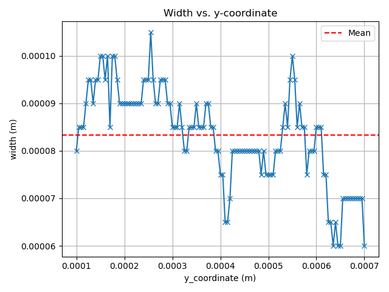

# Measure — laserbeamFoam

## Purpose

This example shows how to apply the SimToPC `measure` workflow to simulation
cases produced by `laserbeamFoam`, which uses a different coordinate convention
from `laserMeltFoam`.

In `laserbeamFoam` the axes are:

- `x`: track width direction
- `y`: build (vertical) direction  — gravity points in `-y`
- `z`: scan direction

SimToPC expects:

- `x`: track width direction
- `y`: scan direction
- `z`: build (vertical) direction

The `adapt_case_to_simtopc.py` utility included in the `tools/` directory
remaps coordinates, updates the gravity vector, and renames the metal VOF
field so that the adapted case is ready for `simtopc measure`.

---

## What This Example Uses

Two completed single-track `laserbeamFoam` simulations of SS316L are provided
as a reduced dataset in a companion repository:

| Case | Power (W) | Effective scan speed (m/s) | Spot diameter (µm) |
|------|-----------|----------------------------|--------------------|
| `test_case_1` | 200 | 1.25 | 75 |
| `test_case_2` | 100 | 0.90 | 75 |

Both simulations use a pulsed laser operating on a
`200 × 200 × 800 µm³` domain discretised with 5 µm cubic cells.

---

## Requirements

- SimToPC installed (see main [README](../../README.md))
- OpenFOAM (for `pvpython` via the ParaView bundled with OpenFOAM)
- Python 3 (for `adapt_case_to_simtopc.py`)
- Access to the companion dataset repository

---

## Step 1 — Get the Reduced Dataset

Clone the companion repository and extract the native laserbeamFoam cases:

```bash
git clone git@github.com:ScimonCFD/SimToPC_laserbeamfoam_data.git
mv SimToPC_laserbeamfoam_data/laserbeamfoam_native.zip .
rm -rf SimToPC_laserbeamfoam_data
unzip laserbeamfoam_native.zip
rm laserbeamfoam_native.zip
```

After extraction the following structure should exist:

```text
examples/measure_laserbeamfoam/
    laserbeamfoam_native/
        test_case_1/   ← mainBody parameters, native laserbeamFoam orientation
        test_case_2/   ← contour parameters, native laserbeamFoam orientation
```

---

## Step 2 — Adapt the Cases to SimToPC Convention

Run `adapt_case_to_simtopc.py` once for each case to remap coordinates and
rename the VOF field:

```bash
cd examples/measure_laserbeamfoam

python ../../tools/adapt_case_to_simtopc.py \
    --src laserbeamfoam_native/test_case_1 \
    --dst laserbeamfoam_adapted/test_case_1

python ../../tools/adapt_case_to_simtopc.py \
    --src laserbeamfoam_native/test_case_2 \
    --dst laserbeamfoam_adapted/test_case_2
```

The script will print a summary of the coordinate mapping applied and the
fields copied. After this step the following structure should exist:

```text
laserbeamfoam_adapted/
    test_case_1/
        constant/polyMesh/   ← points remapped: x→x, z→y, y→z
        constant/g           ← gravity remapped to (0 0 -9.81)
        0.0001/
            alpha.material   ← renamed from alpha.metal
            solidificationTime
    test_case_2/
        (same structure)
```

---

## Step 3 — Run SimToPC

From the `examples/measure_laserbeamfoam` directory, update the
`of_location` path in `config.yml` to match your OpenFOAM installation,
then run:

```bash
simtopc measure config.yml
```

SimToPC will process both adapted cases and write the outputs to
`laserbeamfoam_adapted/test_case_i/measure_results/`.

---

## Expected Outputs

For each adapted case:

- `measure_results/cross_sections_statistics.csv`: section-wise W, H, D, and
  operational void fraction along the scan direction
- `measure_results/row_statistics.csv`: row-level geometry and void counts
- `measure_results/*.png`: diagnostic plots
- `measure_aux/continuous.joblib`: continuity flag for the track
- `measure_aux/meltpool.csv`: extracted melt-pool point cloud

The figure below shows an example width profile extracted from `test_case_1`.



---

## Configuration Notes

The `config.yml` provided here uses `mesh_density: laserbeamfoam_adapted`,
which is the folder produced by Step 2. All measurement parameters match the
5 µm uniform mesh used by both cases:

- `cell_size: 5e-6`
- `x_max: 200e-6` — full lateral domain width
- `y_begin: 100e-6` / `y_end: 700e-6` — nominal scan window, trimmed
  automatically to the observed melt-pool extent

Update `of_location` in `config.yml` to point to your local OpenFOAM
installation before running.

---

## Notes on `adapt_case_to_simtopc.py`

The adapter is a general-purpose utility located in `tools/`. It supports any
combination of scan and build axes and can detect the alpha field name
automatically. Run `python tools/adapt_case_to_simtopc.py --help` for the
full list of options.

The adapter does not modify the source case. The adapted case is written to
a new directory and can be deleted and regenerated at any time.
