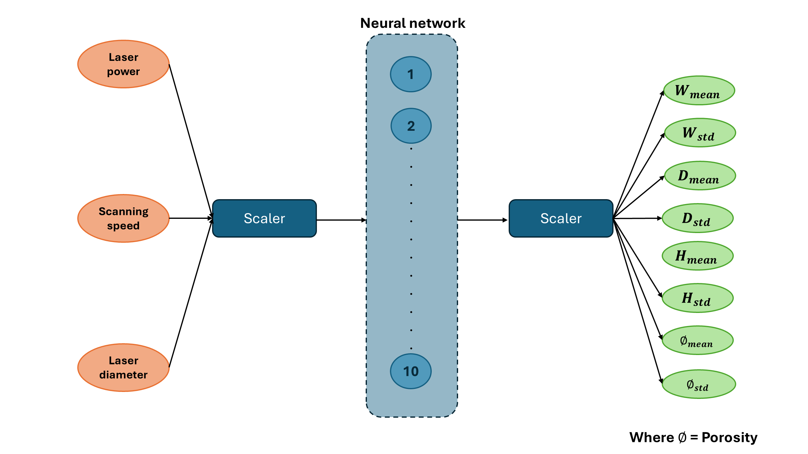
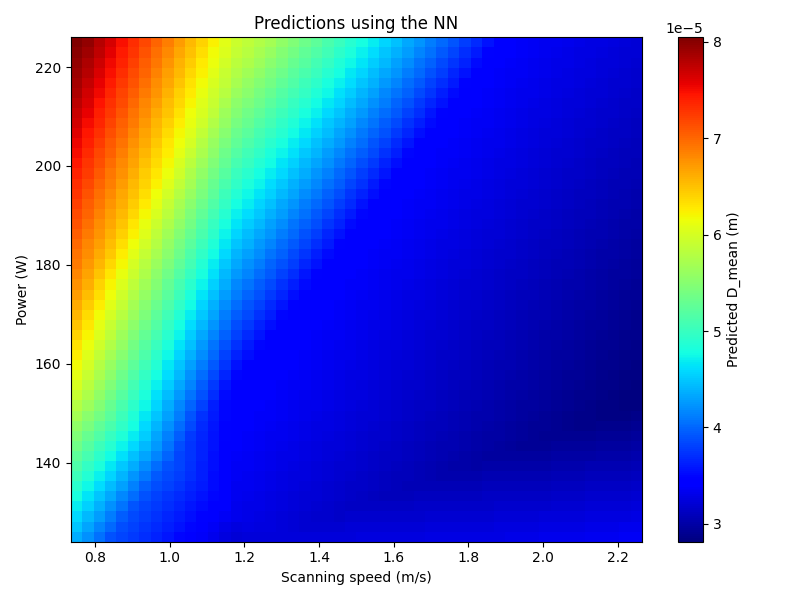
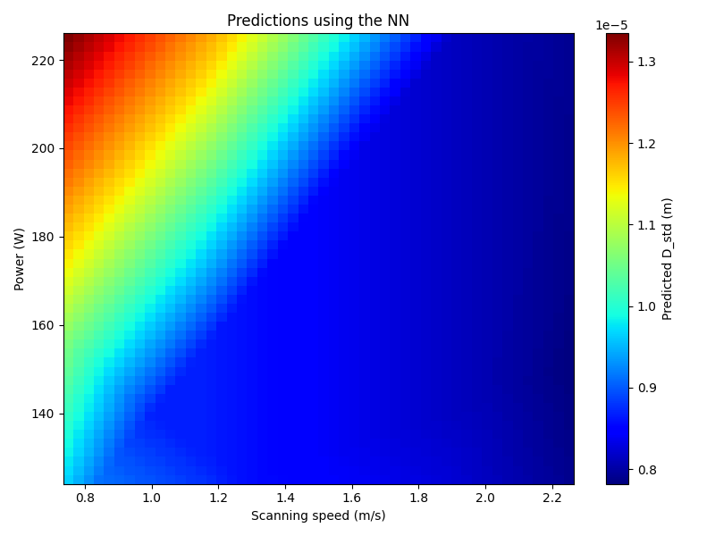

# Surrogate

## Purpose

The `surrogate` mode provides an optional extension of the SimToPC workflow for
training surrogate models from previously extracted melt-pool
characterisation data.

Starting from the datasets generated by the `measure` mode, this command trains
a data-driven surrogate model that maps process parameters to aggregate
melt-pool geometry and porosity metrics. The surrogate can then be used for
rapid exploration of the process-parameter space without the need for
additional high-fidelity simulations.

---

## Workflow dependencies

The `surrogate` mode depends on the outputs generated by the `measure` mode and
cannot be executed independently.

It is therefore assumed that the following steps have been completed:

1. Simulation cases have been generated and executed using the `generate` mode
   (or equivalent precomputed results are available).
2. Melt-pool metrics have been extracted using the `measure` mode.

In the context of the provided tutorials, the computationally expensive
simulation step is not executed. Instead, precomputed simulation results are
used, and the required post-processing steps are executed locally.

---

## Input data

The `surrogate` mode operates on the aggregated datasets produced by the
`measure` mode.

For the tutorial, reduced simulation results are provided in a separate
repository and must be obtained before running the workflow:

    git clone git@github.com:ScimonCFD/SimToPC_measure_data.git

After cloning, follow the instructions in `simtopc/measure/README.md` to:

- reconstruct the mesh for all simulation cases,
- execute the `measure` mode to extract melt-pool metrics,
- generate the aggregated datasets required for surrogate training.

Once the `measure` mode has been executed successfully, the resulting datasets
stored in each `test_case_i` directory are used as input for surrogate model
training.

---

## Optional dependencies

Training surrogate models requires additional Python dependencies that are not
needed for the core SimToPC workflow.

These optional machine-learning dependencies can be installed using:

    pip install .[ml]

Users who do not intend to use the `surrogate` mode do not need to install
these dependencies.

---

## Basic usage

Before running SimToPC, ensure that the Python environment in which the package
was installed is active, as described in the main repository `README.md`.

The `surrogate` mode is invoked through the SimToPC command-line interface:

    simtopc surrogate config.yml

The configuration file specifies the location of the measured datasets, the
process parameters to be used as input features, and the surrogate model
settings.

---

## Surrogate modelling procedure

The surrogate model is trained using the aggregate metrics extracted by the
`measure` mode.

### 1. Data collection

Training data are assembled by combining:

- process parameters (e.g. laser power, scanning speed, laser spot size),
- aggregate melt-pool metrics computed from the cross-sectional data,
  including mean and standard deviation values for:
  - track width (W),
  - track height (H),
  - track depth (D),
  - porosity.

Only simulation cases classified as continuous are used for surrogate training.

---

### 2. Pre-processing

The input and output data are normalised and split into training and validation
datasets prior to model training.

The fitted input and output scalers are stored for later reuse.

---

### 3. Model training

By default, a simple feed-forward neural network is trained to map process
parameters to aggregate melt-pool metrics.

The current implementation consists of:
- an input layer corresponding to the process parameters,
- a single fully connected hidden layer with 10 nodes,
- an output layer predicting the mean and standard deviation of W, H, D, and
  porosity.

This architecture is intended as a minimal demonstration and can be easily
modified by the user. The number of layers, nodes, activation functions, and
optimisation settings can be adjusted to explore alternative surrogate models.

A schematic illustration of the default neural network architecture is shown
below.

---

### 4. Outputs

All outputs generated by the `surrogate` mode are stored in the main working
directory.

The following artefacts are produced:

- the trained surrogate model,
- the input and output scalers used during normalisation,
- diagnostic figures illustrating predicted melt-pool metrics as functions of
  laser power and scanning speed.

By default, the diagnostic figures generated at runtime are saved in a
directory named:

    images_from_predictions/

created in the main working directory.

---

## Example surrogate predictions

As an illustration, the `surrogate` mode generates prediction maps showing how
aggregate melt-pool metrics vary as functions of process parameters.

The figures below show example predictions of the mean and standard deviation
of melt-pool depth as functions of laser power and scanning speed.

These maps provide a compact visualisation of trends in the
process-parameter space and can be used to identify stable operating regions
or parameter combinations associated with excessive penetration or lack of
fusion.

---

## Notes

The `surrogate` mode is optional and is not required to obtain the primary
outputs of SimToPC.

The surrogate model is intended for rapid exploration and qualitative analysis
and does not replace high-fidelity physics-based simulations.
